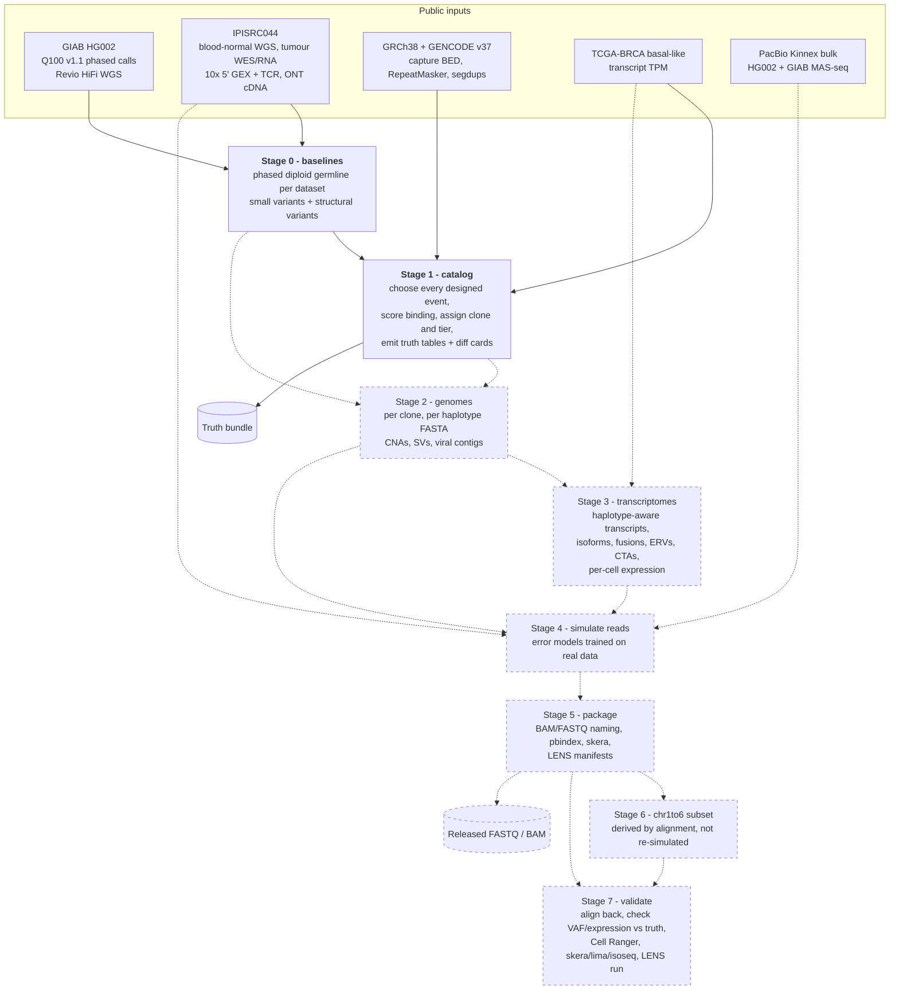
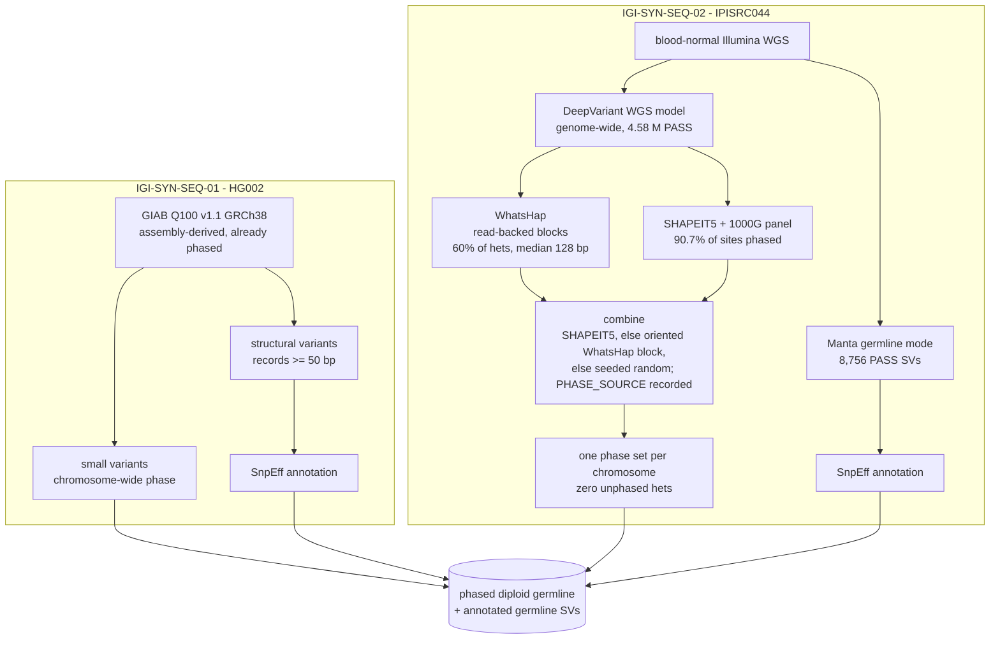
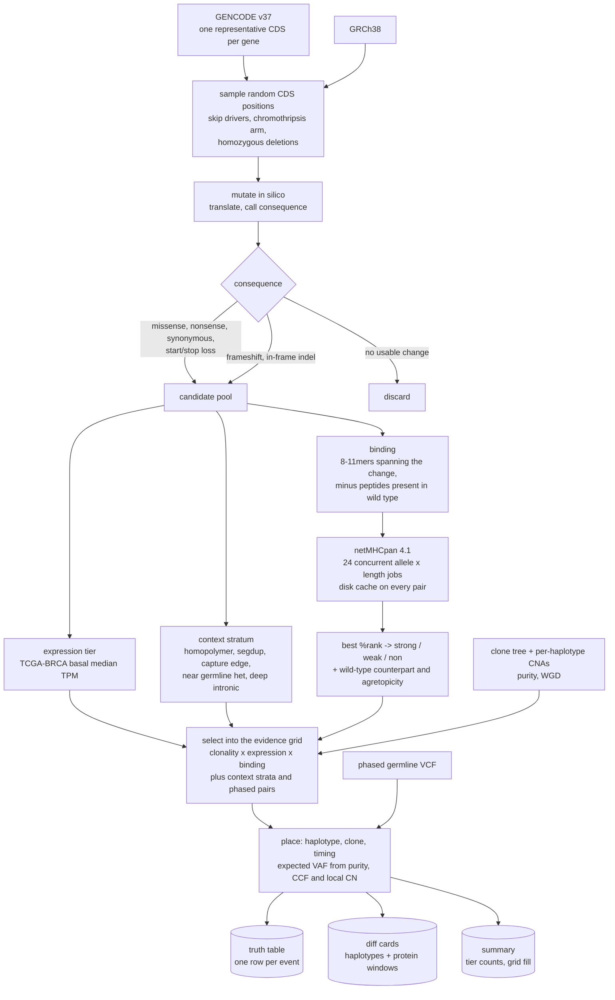
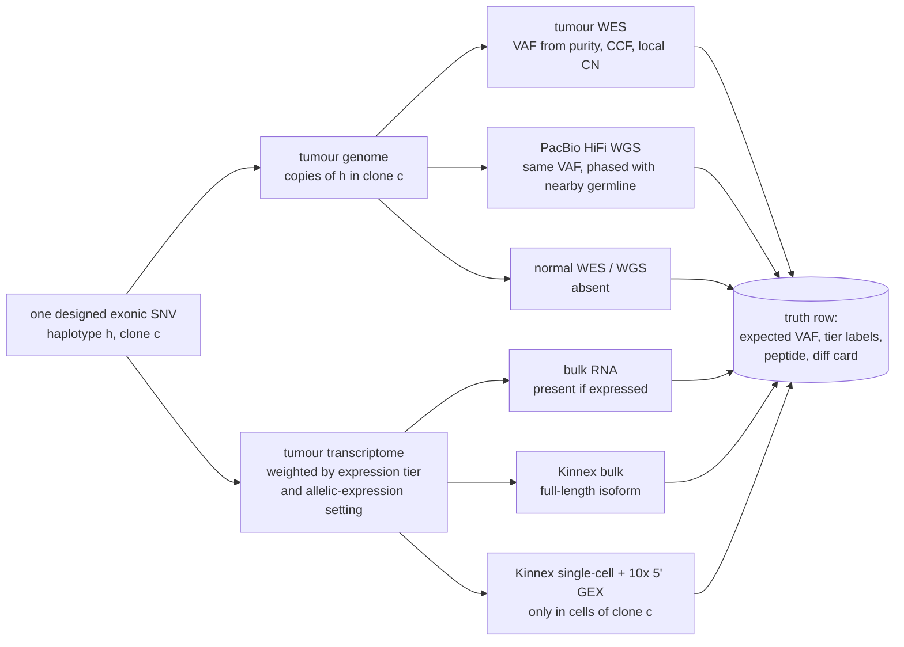

# How IGI-SYN-SEQ is generated

Flowcharts of the generation process, from public inputs to the released FASTQ/BAM files and the truth
bundle. Solid boxes are implemented; dashed boxes are designed but not yet built. Details for each stage
live in `IGI-SYN-SEQ-design.md` (what is generated), `baseline-references.md` (stage 0) and
`catalog-design-notes.md` (stage 1).

## 1. End to end

## 2. Stage 0: how each germline baseline is built

The two datasets reach the same end state, a phased diploid germline, by different routes, because only
one of them comes with a benchmark call set.

Note the asymmetry that drove the design: IPISRC044 has no long-read DNA. Its ONT files are long reads of
the 10x 5' single-cell cDNA libraries, so they carry phase only inside expressed exons and cannot support
long-read SV calling. That is why statistical phasing and a short-read SV caller are used for that dataset.

## 3. Stage 1: inside the catalog designer

## 4. What a single somatic variant has to look like downstream

Every designed event must show up consistently in each assay that can physically see it. This is the rule
stage 3 and stage 4 implement, and the property stage 7 checks.

A deep intronic variant reaches only the WGS box; a synonymous variant reaches the RNA boxes but produces
no peptide; a read-through fusion has no DNA box at all. Those asymmetries are the point: they are what
distinguishes a caller that is reading evidence from one that is guessing.
